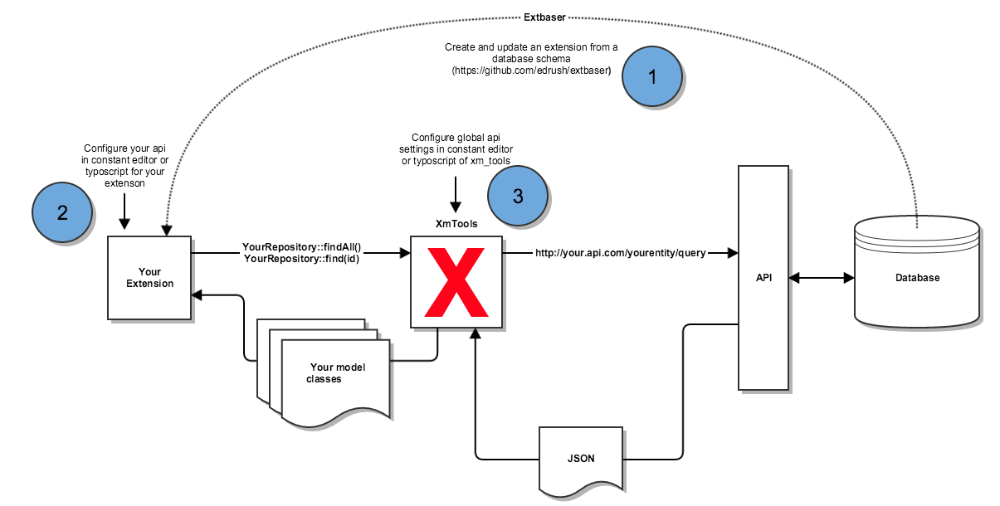

REST-API Connector
------------------

* map TYPO3 model classes to a REST-API
* query and filter them in the same manner as your TYPO3 repositories
* caching supported
* (coming up: doctrine to extbase mapping of models!)

